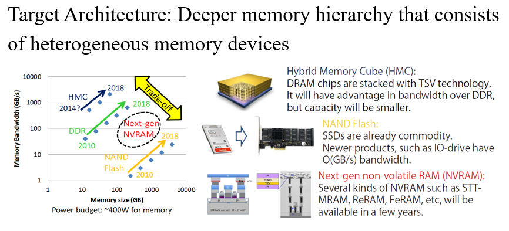
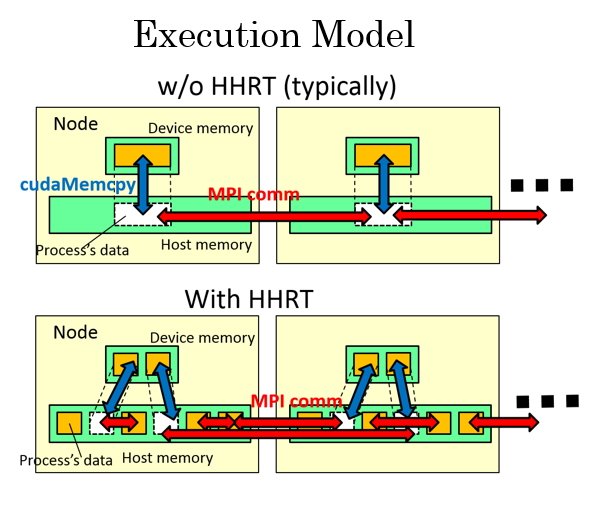
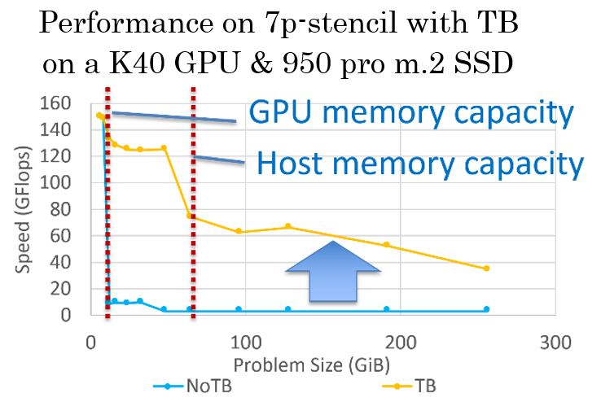
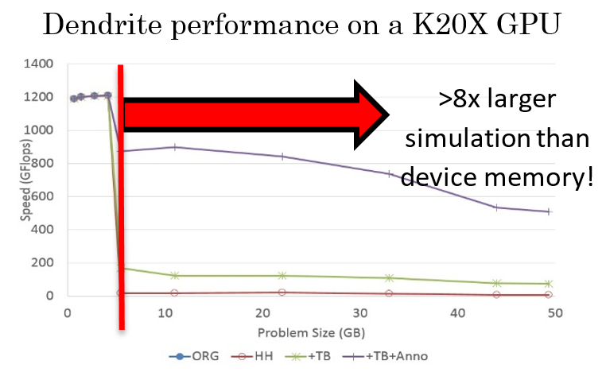
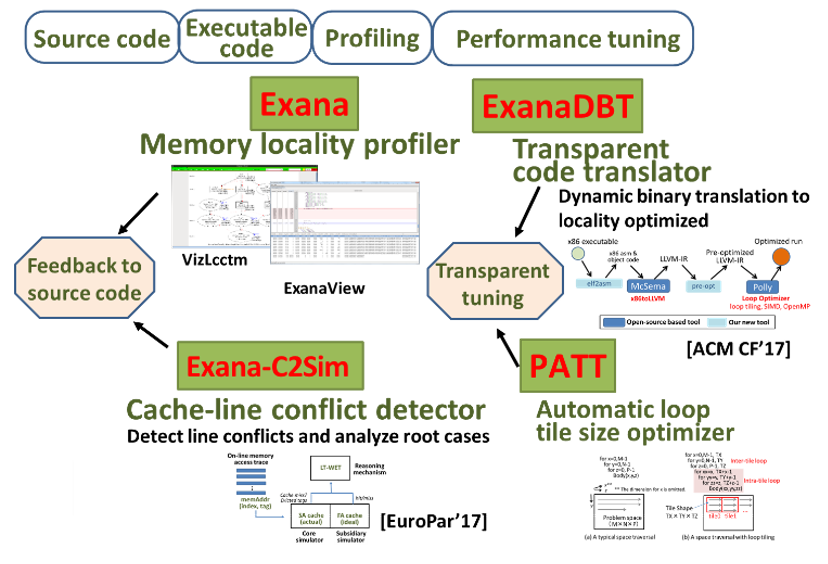
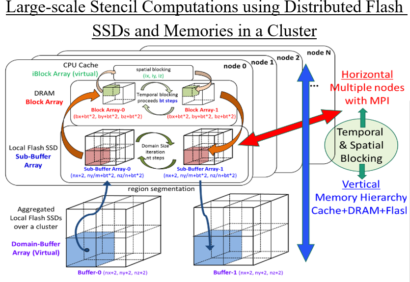
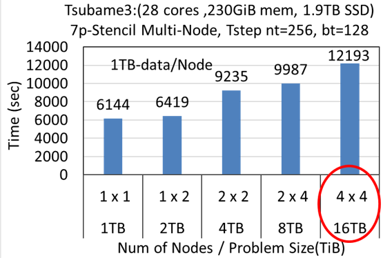
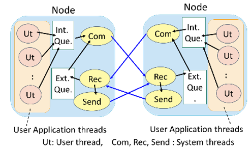
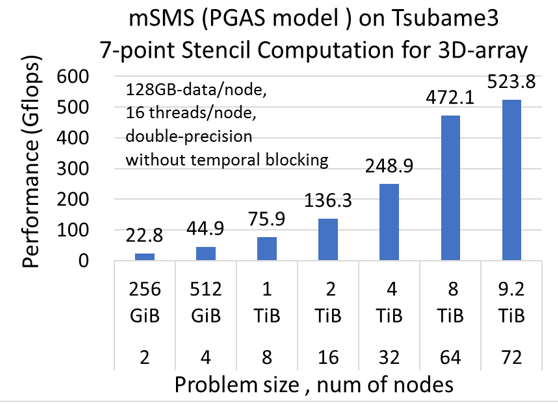

# Team Description

* PI: [Toshio Endo](http://www.el.gsic.titech.ac.jp/~endo/index.html.en) (Tokyo Tech)
* co-PI: Hiroko Midorikawa (Seikei Univ), Yukinori Sato (Toyohashi Univ of Tech) (until Mar 2015)
* Research Period: 2012 - 2017
* [Research highlights in pdf](./brochure-endo-2017.pdf)
* [Summary Slides](./endo-isp2s2-2017.pdf)

# Published software

* [HHRT (Hybrid Hierarchical RunTime)](https://github.com/toshioendo/hhrt): A wrapper library of MPI to expand memory capacity visible to user applications. It supports CUDA+MPI applications. 
* [Exana series](https://github.com/YukinoriSato/ExanaPkg): Exana is a tool chain to assist or automate performance tuning for deeply hierarchical memory.

---
# Project Overview

On Exa-scale supercomputers, the “Memory Wall” problem will become even more severe, which prevents the realization of Extremely Fast&Big Simulations.
This project promotes research towards this problem via co-design approach among application algorithms, system software, architecture.

# Integration of Application Algorithms, System Software and Architecture for Large Data Applications

## HHRT: System Software for GPU Memory Swap

For easier programming, we implemented system software, HHRT (hybrid hierarchical runtime).

- HHRT automatically supports data swapping among three memory layers: GPU memory, host memory, Flash SSDs.
- HHRT supports "process-wise" swapping, not "page-wise" as in OS.
- On the other hand, users still have responsibility to improve locality for better performance, such as Temporal blocking (TB) for stencils.

## Integration with Real Simulation Application

We integrated our techniques with the dendrite simulation [Shimokawabe et al. SC11]. By integrating the implementation written in CUDA+MPI with HHRT and temporal blocking technique, >8x larger simulation is achieved with moderate overhead.

# Tool chains for Memory Locality Profiling and Performance Tuning 

We have been developing tool chains for accelerating system with deeply hierarchical memory.  Starting with source code or its executable code, these tools profile and translate applications for the underlying memory subsystems.  
  Exana is a memory locality profiler and show runtime information of dynamic application behaviors such as precise call and loop nest structures, data dependencies among loop regions, actual memory footprint and loop trip counts, memory access patterns.  Exana-C2Sim is a cache-line conflict detector and can analyze root cases of the line conflicts.  ExanaDBT is a dynamic compilation system for transparent optimization at runtime based on polyhedral optimization technique.  PATT is an automatic loop tile size optimizer for tuning the underlying hierarchical memories. 
  We believe these tool chains enable us to perform automatic/semi-automatic optimizations for deeply ierarchical memory and can contribute to productive software performance engineering. 

# Horizontal and Vertical Memory Extensions  for Large data Applications

The 1000-time latency gap between DRAM and flash is overcome by our advanced implementation using highly parallel AIO and a novel temporal blocking algorithm designed for flash. The available maximum problem size is not limited by the total capacity of DRAMs in a cluster. It can be expanded to the total capacity of distributed flash SSDs in a cluster. When using Tsubame3 (256 GB-DRAM, 2 TB-Flash / node), only 16 nodes are sufficient for 16 TB stencil problem, which usually requires 128 nodes when using only DRAM without our implementation.

## Blk-Tune (Just-in-Time Automatic Blocking Size Setting System for Flash-based Stencil Computations)

Blk-Tune automatically retrieves platform information and finds the globally optimal spatial / temporal blocking sizes to minimize the amount of I/O traffic to the flash SSD in run-time. It realizes just-in-time selection by a search algorithm without any preliminary executions, which differentiates the Blk-Tune from other auto-tuning systems. 

## mSMS (SDSM for General Purpose PGAS Model)

mSMS provides a transparent full-accessible globally shared memory distributed over multiple nodes with a data distribution API. It realizes highly flexible and productive parallel programming environment with OpenMP / pthread interface for each node with node identifiers. In a preliminary evaluation using Tsubame3, a naive stencil computation for large-size (9.2 TiB) problem can be easily implemented over 72 nodes, which achieves 524 Gflops.

